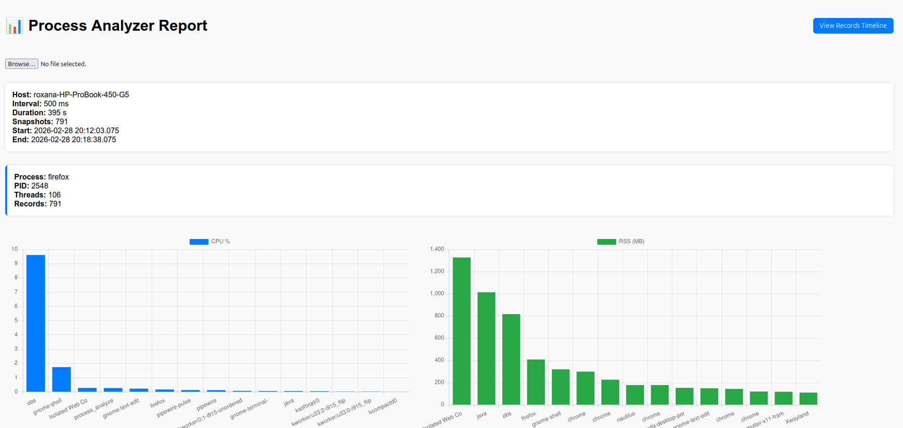
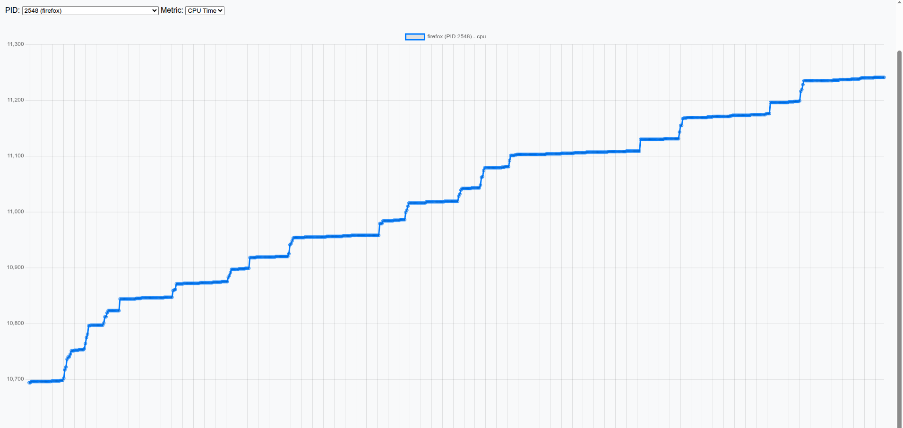
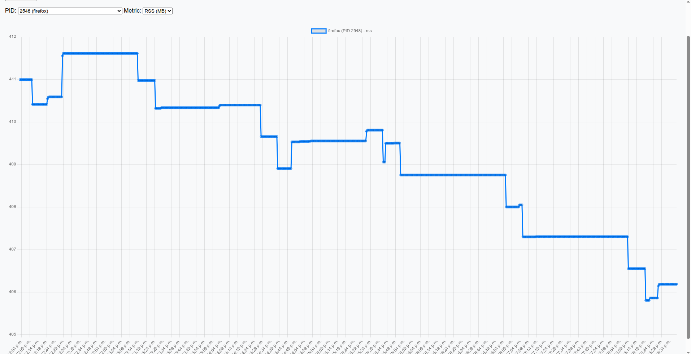
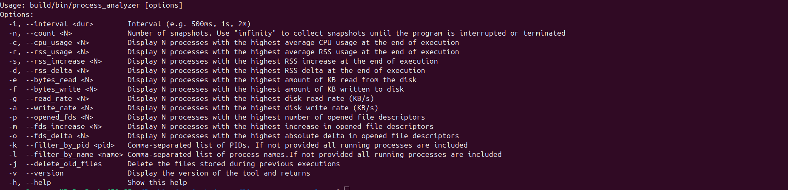
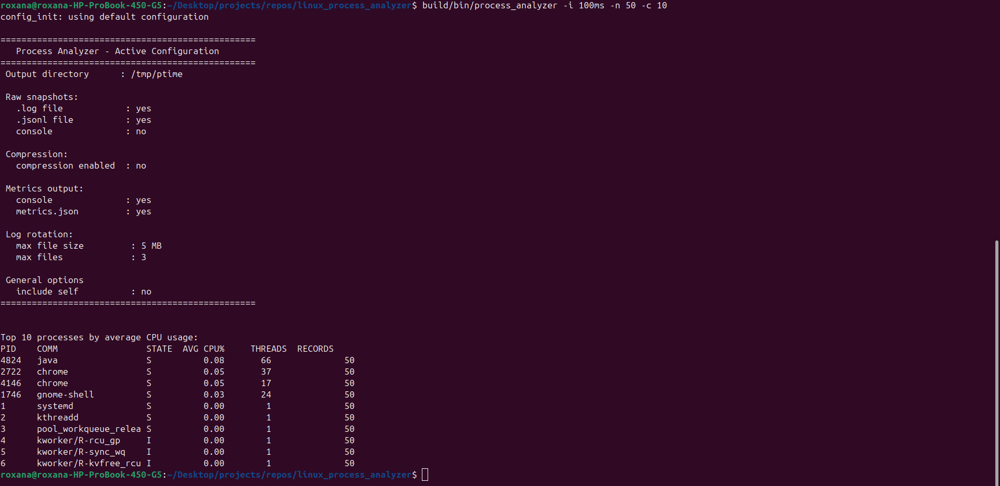

# Linux Process Analyzer

[](https://github.com/cristiantolcea93-netizen/linux_process_analyzer/actions/workflows/ci.yml)
[](https://gitlab.com/cristian.tolcea93/linux_process_analyzer/-/pipelines)


[](https://github.com/cristiantolcea93-netizen/linux_process_analyzer/releases)
[](https://gitlab.com/cristian.tolcea93/linux_process_analyzer/-/releases)


`process_analyzer` is a lightweight Linux command-line tool written in C that periodically samples process information from `/proc` and provides aggregated statistics at the end of execution.

The tool is designed for **low-overhead monitoring**, accurate **time-based calculations**, and **post-run analysis** of CPU, memory (RSS), disk I/O, and file descriptor usage per process. 
It focuses on **low overhead and long-term observation** rather than deep profiling.

**Repository Mirrors**

- Main: [GitHub repo](https://github.com/cristiantolcea93-netizen/linux_process_analyzer)

- Mirror: [GitLab repo](https://gitlab.com/cristian.tolcea93/linux_process_analyzer)

Updates are pushed to both locations when possible.

---

## Features

- Periodic process sampling with configurable interval
- Accurate CPU usage calculation using monotonic time
- Memory (RSS) tracking:
  - Average RSS
  - RSS increase since startup
  - RSS delta
- Disk I/O metrics per process:
  - Total bytes read / written
  - Average disk read/write rate (KB/s)
- File descriptor metrics per process:
  - Currently opened file descriptors
  - File descriptors opened since startup
  - File descriptor delta since startup
- Optional PID and process-name filtering to monitor only selected processes
- Snapshot logging with log rotation
- Graceful shutdown on `CTRL+C` or `SIGTERM`
- Supports infinite runtime mode (`-n infinity`)
- Minimal runtime dependencies (glibc, procfs)
- Optional asynchronous gzip compression for rotated logs
- Prebuilt binaries for Linux x86_64 and ARM64

---

## Demo

### Screenshots

#### Dashboard overview



#### CPU usage graph for one process (firefox)



#### RSS usage graph for one process (firefox)



#### CLI examples

Program help: 


Program execution: 


### Full tutorial

Full tutorial, including: 

- configuration file 
- CLI options
- Dashboard usage

[Watch tutorial](https://www.youtube.com/watch?v=ChIaOgrv-lM)

### CLI Usage Demo

A short walkthrough of `process_analyzer` running from the command line,  
including sampling, metrics generation, and output files.

[Watch demo](https://www.youtube.com/watch?v=ORTR0sKP8P4)

---

### Dashboard Overview

A quick presentation of the HTML dashboard that visualizes `metrics.json`  
and allows interactive exploration of collected data.
 
[Watch demo](https://www.youtube.com/watch?v=IcNMjsw-c2E) 

---

## Typical Use Cases

- Investigating long-running background processes
- Identifying disk-heavy applications over time
- Post-mortem analysis after performance degradation

## What this tool is NOT

- Not a real-time interactive monitor (like `top` or `htop`)
- Not a system-wide resource accounting tool
- Not intended for per-thread profiling

---

## How It Works

At each sampling interval, the tool:

- Reads process data from `/proc/[pid]/stat`, `/proc/[pid]/status`, and `/proc/[pid]/io`
- Reads file descriptor counts from `/proc/[pid]/fd`
- Stores a snapshot of all running processes (or only selected PIDs/process names when filtering is enabled)
- Accumulates statistics over time using **monotonic timestamps**
- Designed to minimize per-sample overhead even at small intervals (tens of milliseconds)

At the end of execution (or when interrupted), the requested metrics are calculated and displayed on the console and in a `metrics.json` file.

---

## Dashboard features

Starting with version 1.1, the project includes a lightweight HTML dashboard  
for visualizing collected metrics.

The dashboard is fully client-side and requires no backend.

If a metrics.json file is present in the dashboard/data directory, it will be loaded automatically when the dashboard starts.

---

## Installation

Prebuilt binaries are available in the [GitHub Releases section](https://github.com/cristiantolcea93-netizen/linux_process_analyzer/releases)

Supported architectures:

- Linux x86_64 (amd64)
- Linux ARM64 (aarch64)

Download the appropriate binary for your system and make it executable:

```bash
chmod +x process_analyzer
```

Then run:

```bash
./process_analyzer -h
```

### Quick Start Example

```bash
./process_analyzer \
    -i 100ms \
    -n 100 \
    -c 10 -r 10 -s 10 -d 10 \
    -e 10 -f 10 \
    -g 10 -a 10 \
    -p 10 -m 10 -o 10
```
### Requirements

Runtime requirements are minimal:

- Linux with `/proc` filesystem
- glibc
- No additional libraries required

---

### Build from source

If you prefer to build manually: 

```bash
./make.sh
```

Or build with tests:

```bash
./makeAll.sh -includeUnitTests -includeIntegrationTests
```
See **Build Instructions** section below for more details.

## Configuration File

The tool supports an external configuration file that controls output behavior and log rotation.

### Configuration File Location

The configuration file path is provided via an environment variable:

```bash
export PROCESS_ANALYZER_CONFIG=/path/to/configuration.config
```

If the variable is not set, default values are used.

If a configuration file is present but invalid, the program exits with an error before starting sampling.

---

### Example Configuration File

```ini
# Output directory (default: /tmp/ptime)
output_dir=/home/user/ptime

# Raw snapshot output
raw_log_enabled=true
raw_jsonl_enabled=true
raw_console_enabled=false

#.log / .jsonl data compression
compression_enabled=false

# Metrics output
metrics_on_console=true
metrics_on_json=true

# Log rotation
max_file_size=5m
max_number_of_files=3

# General options
include_self=false
```

---

### Configuration Options

| Option              | Type    | Default      | Description |
|---------------------|---------|--------------|-------------|
| `output_dir`        | string  | `/tmp/ptime` | Directory for all output files |
| `raw_log_enabled`   | bool    | `true`       | Enable `.log` snapshot files |
| `raw_jsonl_enabled` | bool    | `true`       | Enable `.jsonl` snapshot files |
| `raw_console_enabled` | bool | `false`      | Print raw snapshots to console |
| `compression_enabled` | bool | `false` | Enable gzip compression for rotated raw logs |
| `metrics_on_console`| bool    | `true`       | Print aggregated metrics |
| `metrics_on_json`   | bool    | `true`       | Generate `metrics.json` |
| `max_file_size`     | size    | `5m`         | Max size per rotated file |
| `max_number_of_files` | int  | `3`          | Number of rotated files |
| `include_self`      | bool    | `false`      | Include process_analyzer in analysis |

Supported size suffixes: `k`, `m`, `g`.

---

## Usage

```bash
./process_analyzer [options]
```

### Mandatory options

The following options are **required**:

- `-i`, `--interval <dur>` — sampling interval  
- `-n`, `--count <N>` — number of snapshots (`infinity` is allowed)

---

## Options

```
-i, --interval <dur>        Interval (e.g. 500ms, 1s, 2m)
-n, --count <N>             Number of snapshots

-c, --cpu_usage <N>         Top N by average CPU usage
-r, --rss_usage <N>         Top N by average RSS usage
-s, --rss_increase <N>      Top N by RSS increase
-d, --rss_delta <N>         Top N by RSS delta

-e, --bytes_read <N>        Top N by disk read (KB)
-f, --bytes_write <N>       Top N by disk write (KB)
-g, --read_rate <N>         Top N by read rate (KB/s)
-a, --write_rate <N>        Top N by write rate (KB/s)
-p, --opened_fds <N>        Top N by currently opened file descriptors
-m, --fds_increase <N>      Top N by file descriptors opened since startup
-o, --fds_delta <N>         Top N by file descriptor delta since startup
-k, --filter_by_pid <pid>   Comma-separated list of PIDs to include in the analysis
-l, --filter_by_name <name> Comma-separated list of process names to include in the analysis

-j, --delete_old_files      Delete old log files
-v, --version               Show version
-h, --help                  Show help
```

---

## Example

```bash
./process_analyzer \
    -i 50ms \
    -n infinity \
    -c 10 -r 10 -s 10 -d 10 \
    -e 10 -f 10 \
    -g 15 -a 15 \
    -p 10 -m 10 -o 10 \
    -j
```

Stop the program using `CTRL+C`.

### Filtering by PID

Monitor only specific processes:

```bash
./process_analyzer \
    -i 1s \
    -n 100 \
    -k 1234,5678
```

### Filtering by Process Name

Monitor only processes matching one or more `comm` names:

```bash
./process_analyzer \
    -i 1s \
    -n 100 \
    -l systemd,bash
```

### Filtering by Process Name or PID

If both `-k` and `-l` are provided, both filters are applied. **OR** rule is used between them.

```bash
./process_analyzer \
    -i 1s \
    -n 100 \
    -c 10 \
    -l systemd,bash \
    -k 1234,5678
```

The example from above will include in the analysis: 

- all processes named "systemd" and "bash"
- processes with PID 1234 and 5678

---

## Snapshot Logs

Each sampling iteration is logged as a snapshot.

### Text format

```
[2026-01-11 19:19:49.611] SNAPSHOT START #################
PID=1548 COMM=systemd STATE=S PPID=1 UTIME=71 STIME=21 RSS(KB)=12592 IOR(KB)=0 IOW(KB)=0 THREADS=1 FD=4
PID=1558 COMM=pipewire STATE=S PPID=1548 UTIME=2514 STIME=2346 RSS(KB)=16776 IOR(KB)=1180 IOW(KB)=0 THREADS=3 FD=18
...
SNAPSHOT END #################
```

### JSONL format

```
{"timestamp":"2026-01-19 21:47:41.677","pid":2603,"comm":"eclipse","state":"S","ppid":1800,"utime":7,"stime":1,"rss_kb":23376,"io_read_kb":640,"io_write_kb":0,"threads":5,"fds":112}
{"timestamp":"2026-01-19 21:47:41.677","pid":2618,"comm":"java","state":"S","ppid":2603,"utime":19907,"stime":1161,"rss_kb":1129624,"io_read_kb":212404,"io_write_kb":16744,"threads":70,"fds":196}
{"timestamp":"2026-01-19 21:47:41.677","pid":2677,"comm":"nautilus","state":"S","ppid":1515,"utime":204,"stime":32,"rss_kb":178828,"io_read_kb":6132,"io_write_kb":80,"threads":19,"fds":31}
```

---

## Log Storage & Rotation

All output files are stored in `output_dir`.

By default:

```
/tmp/ptime/
```

Rotation settings are configurable via the config file.

---

## Compression

Starting with version 1.2, the tool supports optional gzip compression for rotated snapshot logs.

Compression is designed to run **asynchronously** and does not block the sampling loop.

### How It Works

When log rotation occurs:

1. The active log file is renamed to a rotated filename.
2. A compression job is queued.
3. A background worker thread compresses the file using gzip.
4. The compressed file replaces the rotated file.
5. The original uncompressed file is removed.

This design guarantees:

- Minimal impact on sampling performance
- No blocking I/O in the main thread
- Safe operation even under frequent rotations

### File Naming

During rotation with compression enabled:

```
ptime.jsonl → active file
ptime.jsonl.1.gz → most recent rotated file
ptime.jsonl.2.gz → older files
```

...

Temporary filenames may briefly appear during compression but are automatically cleaned up afterward.

### Configuration

Compression is controlled via:

```
compression_enabled=true
```

If compression is disabled:

- Rotated files remain uncompressed
- No worker thread is created
- No additional CPU overhead occurs

### Performance impact

Compression runs in a dedicated worker thread.

Typical overhead:
- ~1% additional CPU at very high sampling rates (≈15 ms interval, 100 MB file size)
- Negligible impact at ≥100 ms intervals

### Implementation details

The compression subsystem is implemented in:

```
code/compression/
    compression_worker.c
    compression_worker.h
```

Key characteristics:
- Thread-safe job queue
- Condition-variable based worker wakeup
- Graceful shutdown support
- Failure-safe file handling
- Uses zlib (gzopen, gzwrite)

---

## Time Handling

- **`CLOCK_MONOTONIC`** is used internally for all delta and rate calculations  
  (CPU usage, disk I/O rates, averages)
- **`CLOCK_REALTIME`** is used only for human-readable timestamps in logs

This guarantees stable measurements even if the system clock changes.

---

## JSON Output

- `metrics.json` follows a versioned schema
- Schema documentation: [SCHEMA.md](SCHEMA.md)
- Snapshot data uses JSON Lines format (`.jsonl`)

---

## Performance & Benchmark

Tests were performed on:

- CPU: Intel Core i7 (8th generation, 8 cores)
- Laptop: HP ProBook 450 G5
- OS: Ubuntu Linux

### Results

| Sampling Interval | CPU Usage (process_analyzer) |
|-------------------|------------------------------|
| 15 ms             | ~12% (single core saturated) |
| 30 ms             | ~7.5%                        |
| 1 s               | ~0.17–0.2%                   |

Notes:

- At very small intervals (<20ms), one CPU core may reach near 100%
- For long-running monitoring, intervals ≥100ms are recommended
- With compression enabled, CPU usage increases by approximately ~1% at very small sampling intervals (≈15 ms).  
- At typical monitoring intervals (≥100 ms), the compression impact is negligible.
---

## Build Instructions

### Recommended (Root Scripts)

The recommended way to build the project is using the helper scripts from the
project root directory:

```bash
./make.sh
```

Or:

```bash
./makeAll.sh
```
Both scripts support the following optional parameters:

- `-includeUnitTests`
- `-includeIntegrationTests`


Examples: 

```bash
# Build only
./make.sh

# Build + unit tests
./make.sh -includeUnitTests

# Build + unit + integration tests
./make.sh -includeUnitTests -includeIntegrationTests
```
If no parameters are provided, only the build is executed.

### Manual Build (Advanced / Development Use)

```bash
cd code
./make.sh
```
Or using Ninja:

```bash
mkdir build
cd build
cmake ..
ninja
```

Note: Manual builds do not run tests automatically.
For full validation, use the root build scripts.

---

## Project Structure

```
├── code/ # Core source code
│ ├── process_analyzer.c # Main entry point
│ ├── args_parser/
│ │ ├── args_parser.c
│ │ └── args_parser.h
│ ├── config/
│ │ ├── config.c
│ │ └── config.h
│ ├── compression/
│ │ ├── compression_worker.c
│ │ └── compression_worker.h
│ ├── process_snapshot/
│ │ ├── process_snapshot.c
│ │ └── process_snapshot.h
│ ├── process_stats/
│ │ ├── process_stats.c
│ │ └── process_stats.h
│ ├── third_party/
│ │ └── uthash/
│ │ 	└── uthash.h
│ └── CMakeLists.txt
│
├── dashboard/ # client side HTML dashboard 
├── tests/ # Test suites
│ ├── unit/ # Unit tests
│ └── integration/ # Integration tests
│
├── make.sh # Main build script
├── makeAll.sh # Clean + full rebuild script
```

---

### Features

- Interactive charts for all aggregated metrics
- Per-process info box (PID, threads, records)
- Click on any bar to jump to detailed timeline view
- Records page for `.jsonl` exploration by PID and metric
- Remembers last loaded file in browser storage

### How to Use

1. Run `process_analyzer` normally
2. Open `dashboard/index.html` in your browser
3. Upload the generated `metrics.json`
4. Optionally open `records.html` for timeline exploration

No installation required — just open the HTML file locally.

---

## Testing

The project includes both unit tests and integration tests.

- Unit tests validate individual modules
- Integration tests validate real execution scenarios

Tests can be enabled using:

```bash
./make.sh -includeUnitTests -includeIntegrationTests
# or
./makeAll.sh -includeUnitTests -includeIntegrationTests
```

## Limitations & Notes

- Requires Linux with `/proc`
- Disk I/O depends on kernel support
- Short-lived processes may have fewer samples
- Tested on modern systemd-based distributions

### Missing RSS and I/O data

RSS and I/O values are reported as `-1` when unavailable.

Common causes:

1. Kernel threads (`kworker/*`)
2. Process exits during sampling

### Impact on aggregated metrics

Invalid samples are excluded from calculations.

Only dependent metrics are skipped.

---

## Future Improvements

- Extended configuration support
- Plugin system
- Built-in visualization
- Python analysis tools

---

## Author

Developed as a learning and analysis tool for Linux process monitoring.

---

## License

MIT License
